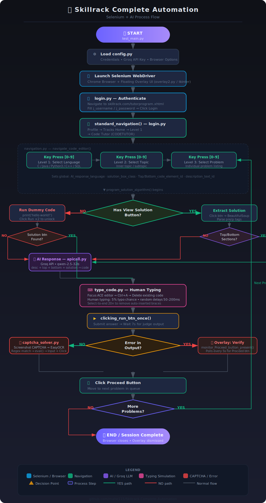

# 🤖 Skillrack Complete Automation

> A Selenium-powered Python bot that autonomously navigates, solves, and submits coding challenges on [Skillrack](https://www.skillrack.com) using AI-generated solutions, OCR-based CAPTCHA solving, and human-like typing simulation.

## 🔍 Overview

Skillrack Complete Automation is an end-to-end browser automation system that:

1. **Logs into** Skillrack using stored credentials
2. **Navigates** to the Code Tutor section and selects a language/topic
3. **Identifies** whether a solution is available or needs AI generation
4. **Solves CAPTCHA** automatically using EasyOCR
5. **Types the solution** into the ACE editor with human-like simulation
6. **Submits and proceeds** to the next problem autonomously

The system integrates a live overlay UI, Groq's `qwen-2.5-32b` LLM for AI code generation, and BeautifulSoup for structured HTML extraction.

---

## 🏗️ Architecture

```
┌─────────────────────────────────────────────────────┐
│                     test_main.py                    │
│              (Entry Point / Orchestrator)           │
└────────────┬───────────┬──────────────┬─────────────┘
             │           │              │
       login.py    navigation.py    overlay2.py
             │           │
    ┌────────▼──┐  ┌──────▼────────────────────────┐
    │  Selenium  │  │  solution_extractor.py        │
    │  WebDriver │  │  + BeautifulSoup Parser       │
    └────────────┘  └──────────┬────────────────────┘
                               │
                 ┌─────────────▼─────────────┐
                 │       apicall.py          │
                 │   Groq API (qwen-2.5-32b) │
                 └─────────────┬─────────────┘
                               │
                 ┌─────────────▼─────────────┐
                 │       type_code.py        │
                 │  Human Typing Simulation  │
                 └─────────────┬─────────────┘
                               │
                 ┌─────────────▼─────────────┐
                 │    captcha_solver.py      │
                 │  EasyOCR + Math Eval      │
                 └───────────────────────────┘
```

---

## 📦 Module Breakdown

### `config.py`
Stores the user's Skillrack credentials (`LOGIN_ID`, `LOGIN_PASSWORD`) and Groq API key. This is the only file you need to edit before running.

---

### `login.py`
**Responsibilities:**
- Navigates to `https://www.skillrack.com/faces/candidate/tutorprogram.xhtml`
- Fills in `j_username` and `j_password` fields using Selenium's `WebDriverWait`
- Clicks the login button and updates the overlay status
- Calls `standard_navigation()` to navigate: Profile → Tracks → Level 1 → Code Tutor

---

### `navigation.py`
**Responsibilities:**
- `navigate_code_editor()`: Handles 3 levels of navigation input:
  - **Level 1** — Select programming language (C, Java, Python3, C++, SQL)
  - **Level 2** — Select topic/inner section
  - **Level 3** — Select individual problem from the listing
- Sets global variables for language-specific solution box IDs, top/bottom code IDs, and description element IDs

- `program_solution_algorithm()`: Main problem-solving logic:
  1. Checks if a "View Solution" button exists
  2. If yes — clicks it, extracts solution HTML, parses it with BeautifulSoup
  3. Checks for top/bottom code sections (Hands-On problems)
  4. If top/bottom exists — sends everything to the AI (`AI_response()`)
  5. If no top/bottom — types the extracted solution directly
  6. If no solution button — runs a dummy `print('hello world!')` to unlock the solution button, then re-extracts
  7. Falls back to pure AI generation from description alone if no solution is ever found

---

### `solution_extractor.py`
**Responsibilities:**
- `solution_extraction()` — Waits for `solutionDialog` or `solnXXX` div to appear, captures raw HTML, parses `<pre>` and `<p>` tags using BeautifulSoup, strips indentation, closes the dialog

- `top_bottom_code_extraction()` — Detects presence of top/bottom code section IDs (`j_id_7a`, `j_id_7g`, `j_id_8o`, `j_id_8u`) and extracts them as clean text

- `description_extraction()` — Extracts problem statement from different div IDs (`j_id_58`, `j_id_6m`) depending on the topic selected

- `AI_response()` — Bundles description + top + bottom + solution and forwards to `apicall.py`

---

### `apicall.py`
**Responsibilities:**
- Connects to Groq's API using the `groq` Python client
- Uses the `qwen-2.5-32b` model with `temperature=0` for deterministic output
- System prompt strictly instructs the model to return **only missing code lines** — no explanations, no markdown
- Streams tokens and accumulates the full response
- Strips leading indentation from every returned line

---

### `type_code.py`
**Responsibilities:**
- `auto_type_rough_code()` — Types a short placeholder code (e.g., `print('hello world!')`) to trigger solution reveal
- `auto_type_extracted_code()` — Full code entry pipeline: focuses editor → Ctrl+A → Delete → calls `human_typing()`
- `human_typing()` — Introduces randomized delays (50ms–200ms per char), 5% typo chance with self-correction, occasional 300–700ms long pauses to mimic human behavior
- `clicking_run_btn_once()` / `clicking_run_btn_twice()` — Clicks the run button with proper wait states
- `select_until_end()` — Uses Ctrl+Shift+Right Arrow 20× to remove auto-inserted braces from the ACE editor

---

### `captcha_solver.py`
**Responsibilities:**
- `solve_captcha()` — Screenshots the CAPTCHA image element, runs it through EasyOCR, extracts a math equation using regex (`\d+ [+\-*/] \d+`), evaluates the expression, inputs the answer and clicks "Proceed"
- `monitor_Proceed_button_present()` — Polling loop that watches for the Proceed button to appear (typically after test cases pass), clicks it once found

---

### `overlay2.py`
**Responsibilities:**
- Spawns a floating `tkinter` window on top of the browser
- Displays real-time status messages like "⚡ Logging in...", "🤖 Typing AI Solution..."
- Runs in a separate thread so it doesn't block the main Selenium flow

---

## 🔄 Process Flow

```
START
  │
  ▼
Load config (credentials + API key)
  │
  ▼
Launch Selenium WebDriver + Overlay UI
  │
  ▼
login.py → Fill username/password → Submit
  │
  ▼
standard_navigation() → Profile → Tracks → L1 → Code Tutor
  │
  ▼
User presses key [0–9] → navigate_code_editor() (Level 1: Language)
  │
  ▼
User presses key [0–9] → navigate_code_editor() (Level 2: Topic)
  │
  ▼
User presses key [0–9] → navigate_code_editor() (Level 3: Problem)
  │
  ▼
program_solution_algorithm()
  │
  ├─── [Has View Solution button?] ──YES──►
  │                                         Click View Solution
  │                                         Extract solution HTML (BeautifulSoup)
  │                                         Has Top/Bottom sections?
  │                                           ├─ YES → AI_response(desc+top+bottom+soln)
  │                                           └─ NO  → use extracted solution directly
  │
  ├─── [No View Solution] ──────────────►
  │                                         Run dummy code (print 'hello world!')
  │                                         Run button clicked TWICE
  │                                         Wait for solution button to appear
  │                                           ├─ Found → Extract + AI or direct type
  │                                           └─ Not found → Pure AI from description
  │
  ▼
type_code.py → Human-like typing into ACE editor
  │
  ▼
clicking_run_btn_once() → Submit answer
  │
  ▼
[Error in output?]
  ├─ YES → Overlay: "Verify by Yourself" + monitor Proceed button
  └─ NO  → captcha_solver.py → Solve math CAPTCHA → Click Proceed
  │
  ▼
Next problem ← loop back
```

---

## 🛠️ Tech Stack

| Component | Library/Tool |
|---|---|
| Browser Automation | `selenium` + ChromeDriver |
| HTML Parsing | `beautifulsoup4` |
| CAPTCHA Solving | `easyocr`, `Pillow`, `numpy` |
| AI Code Generation | `groq` (Qwen 2.5 32B) |
| Human Typing Simulation | `pynput`, `selenium ActionChains` |
| Overlay UI | `tkinter` |
| Image Processing | `Pillow`, `numpy` |

---

## ✅ Prerequisites

- Python 3.10+
- Google Chrome browser installed
- ChromeDriver matching your Chrome version (auto-managed if using `webdriver-manager`)
- A valid Groq API key (free tier available at [console.groq.com](https://console.groq.com))
- A Skillrack account

---

## 📥 Installation

```bash
# Clone the repository
git clone https://github.com/mahe115/Skillrack-Complete-Automation.git
cd Skillrack-Complete-Automation

# Install dependencies (Windows)
install_dependencies.bat

# Or manually
pip install -r requirements.txt
```

---

## ⚙️ Configuration

Edit `config.py` before running:

```python
# config.py
LOGIN_ID = "your_skillrack_email"
LOGIN_PASSWORD = "your_skillrack_password"
```

Also update the Groq API key in `apicall.py`:

```python
client = Groq(api_key="your_groq_api_key_here")
```

> ⚠️ **Never commit credentials to a public repo.** Move these to environment variables or a `.env` file.

---

## 🚀 Usage

```bash
python test_main.py
```

Once running:
1. A Chrome browser will open and log into Skillrack automatically
2. A floating status overlay appears in the top-right corner
3. The automation navigates to the Code Tutor section
4. Press number keys `[0–9]` to select language → topic → problem
5. The bot handles everything from solution extraction to CAPTCHA solving

---

## 📁 File Structure

```
Skillrack-Complete-Automation/
├── test_main.py           # Entry point / main orchestrator
├── config.py              # Credentials and settings
├── login.py               # Login + initial navigation
├── navigation.py          # Problem navigation + solve algorithm
├── solution_extractor.py  # HTML parsing and code extraction
├── apicall.py             # Groq LLM API integration
├── type_code.py           # Human-like ACE editor typing
├── captcha_solver.py      # EasyOCR CAPTCHA solver + Proceed monitor
├── overlay2.py            # Floating tkinter status UI
├── typerman.py            # (Utility) Typing helpers
├── typeroverlay.py        # (Utility) Overlay typing helpers
├── indentation check.py   # (Utility) Code indentation validator
├── APICALLexample.py      # Example API usage reference
├── requirements.txt       # Python dependencies
├── install_dependencies.bat  # Windows one-click installer
└── README.md
```

---

## ⚠️ Known Limitations

- **ACE Editor Focus** — The automation requires the browser window to remain in the foreground during typing; switching windows interrupts the flow
- **CAPTCHA Accuracy** — EasyOCR may occasionally misread complex fonts; the bot exits on failure
- **Dynamic Element IDs** — Skillrack uses JSF-generated IDs (`j_id_XY`) that may change across sessions or platform updates, requiring occasional ID map updates
- **GPU Dependency** — EasyOCR is configured with `gpu=True`; change to `gpu=False` if no CUDA GPU is available
- **Rate Limits** — Groq's free tier has token limits; heavy usage may hit quota

---

## ⚖️ Disclaimer

This project is built for **educational and personal productivity** purposes only. Using automation tools on third-party platforms may violate their Terms of Service. The author takes no responsibility for account bans or academic integrity violations resulting from misuse. Review Skillrack's Terms of Service before using this tool.

---

## 🙌 Author

Built by [mahe115](https://github.com/mahe115) — CS (AI/ML) student passionate about automation, ML engineering, and intelligent systems.
